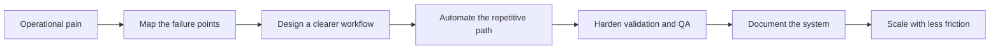
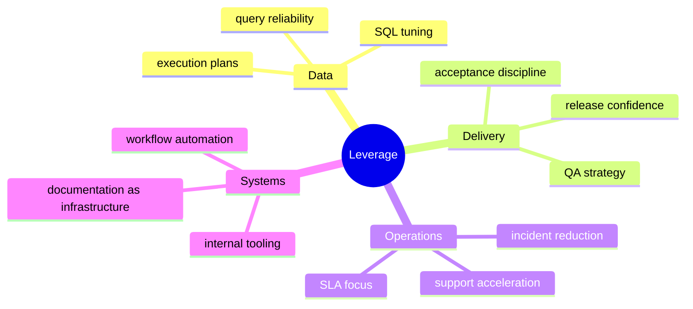

<div align="center">


# Systems builder with an operations mindset

<p>
  I build backend, AI-assisted, and operational systems that reduce friction, improve reliability, and survive production.
</p>

<p>
  <a href="https://www.linkedin.com/in/gimenez-agustin">
    
  </a>
  
  
</p>

</div>

---

## Snapshot

```text
Role      : IT Lead | Technical Operations | QA | SQL Server / Azure SQL
Focus     : AI workflows, backend reliability, support acceleration, delivery confidence
Strength  : turning messy operational realities into systems that scale
Approach  : clarity, traceability, hardening, and execution over noise
```

## Impact

<table>
  <tr>
    <td align="center" width="33%">
      <h3>40%</h3>
      <p>reduction in SQL processing times through tuning, indexing, and redesign</p>
    </td>
    <td align="center" width="33%">
      <h3>35%</h3>
      <p>drop in recurring incidents through documentation and standardized processes</p>
    </td>
    <td align="center" width="33%">
      <h3>2022 - now</h3>
      <p>leading IT operations, QA direction, support flow, and technical delivery at LenoxHR</p>
    </td>
  </tr>
</table>

## What I Actually Build

<table>
  <tr>
    <td width="50%" valign="top">

### Systems

- Backend services and integrations
- SQL Server and Azure SQL optimization
- AI-assisted internal workflows
- Operational tooling for support and QA
- CI/CD and validation loops

  </td>
  <td width="50%" valign="top">

### Outcomes

- Faster and safer technical delivery
- Lower operational drag
- Better traceability across teams
- Stronger QA and acceptance discipline
- Documentation that becomes execution, not shelfware

  </td>
  </tr>
</table>

## Operating Model



## Current Direction

I work at the intersection of technical operations, backend systems, QA rigor, and applied AI.

That means:

- designing practical AI workflows for internal teams
- improving support and help desk throughput
- formalizing QA strategy and acceptance criteria
- coordinating delivery between business, support, and development
- making data, process, and documentation more reliable

## Experience Surface

| Area | Depth |
| --- | --- |
| SQL Server / Azure SQL | tuning, indexes, execution plans, query reliability |
| QA Leadership | test strategy, defect flow, acceptance criteria, DRE mindset |
| Help Desk Operations | SLA, prioritization, diagnosis, escalation discipline |
| Technical Delivery | cross-team coordination, validation, release readiness |
| Documentation | endpoint standardization, process clarity, operational traceability |
| Cloud / Infra | hosting, domains, mail workers, Cloudflare, Azure |

## Where I Create Leverage



## Principles

> Build for the environment that actually exists.
>
> Reduce friction before adding complexity.
>
> Treat code, operations, QA, and documentation as one system.

## Scope

<p>
  
  
  
  
  
  
  
  
</p>

<div align="center">
  
</div>
